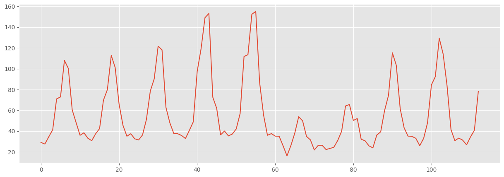

# Tytuł naszego raportu


```python
# Render our plots inline
%matplotlib inline
```


```python
import pandas as pd
import matplotlib.pyplot as plt
```


```python
# Make the graphs a bit prettier, and bigger
plt.style.use('ggplot')
plt.rcParams['figure.figsize'] = (15, 5)
```


```python
data_frame = pd.read_csv("city_6_2_data.csv", delimiter=",")
```


```python
data_frame
```


<div>
<style scoped>
    .dataframe tbody tr th:only-of-type {
        vertical-align: middle;
    }

    .dataframe tbody tr th {
        vertical-align: top;
    }

    .dataframe thead th {
        text-align: right;
    }
</style>
<table border="1" class="dataframe">
  <thead>
    <tr style="text-align: right;">
      <th></th>
      <th>tys_osob</th>
      <th>month</th>
    </tr>
  </thead>
  <tbody>
    <tr>
      <th>0</th>
      <td>29.1</td>
      <td>2015-01</td>
    </tr>
    <tr>
      <th>1</th>
      <td>27.6</td>
      <td>2015-02</td>
    </tr>
    <tr>
      <th>2</th>
      <td>34.6</td>
      <td>2015-03</td>
    </tr>
    <tr>
      <th>3</th>
      <td>41.3</td>
      <td>2015-04</td>
    </tr>
    <tr>
      <th>4</th>
      <td>71.0</td>
      <td>2015-05</td>
    </tr>
    <tr>
      <th>...</th>
      <td>...</td>
      <td>...</td>
    </tr>
    <tr>
      <th>108</th>
      <td>31.3</td>
      <td>2024-01</td>
    </tr>
    <tr>
      <th>109</th>
      <td>26.8</td>
      <td>2024-02</td>
    </tr>
    <tr>
      <th>110</th>
      <td>34.4</td>
      <td>2024-03</td>
    </tr>
    <tr>
      <th>111</th>
      <td>40.8</td>
      <td>2024-04</td>
    </tr>
    <tr>
      <th>112</th>
      <td>78.1</td>
      <td>2024-05</td>
    </tr>
  </tbody>
</table>
<p>113 rows × 2 columns</p>
</div>


```python
data_frame["tys_osob"].plot()
```


    <Axes: >


    

    


```python

```
